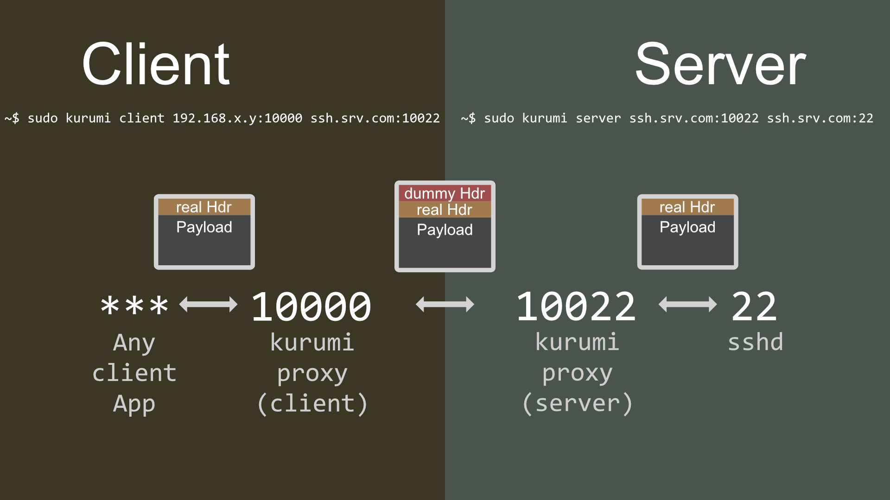

# kurumi-proxy
## Client and Server side proxy to spoof any TCP protocol as HTTP

## General Usage.

### Server side
`~$ sudo kurumi server [Server IP]:[Proxy Port of Server] [Server IP]:[Application Listen Port]`

### Client side
`~$ sudo kurumi client [Client IP]:[Proxy Port of Client] [Server IP]:[Proxy Port of Server]`

## Use as proxy to spoof SSH stream as HTTP.

### Server side
`~$ sudo kurumi server ssh.srv.com:10022 localhost:22`

### Client side
`~$ sudo kurumi client 192.168.x.y:10000 ssh.srv.com:10022`
